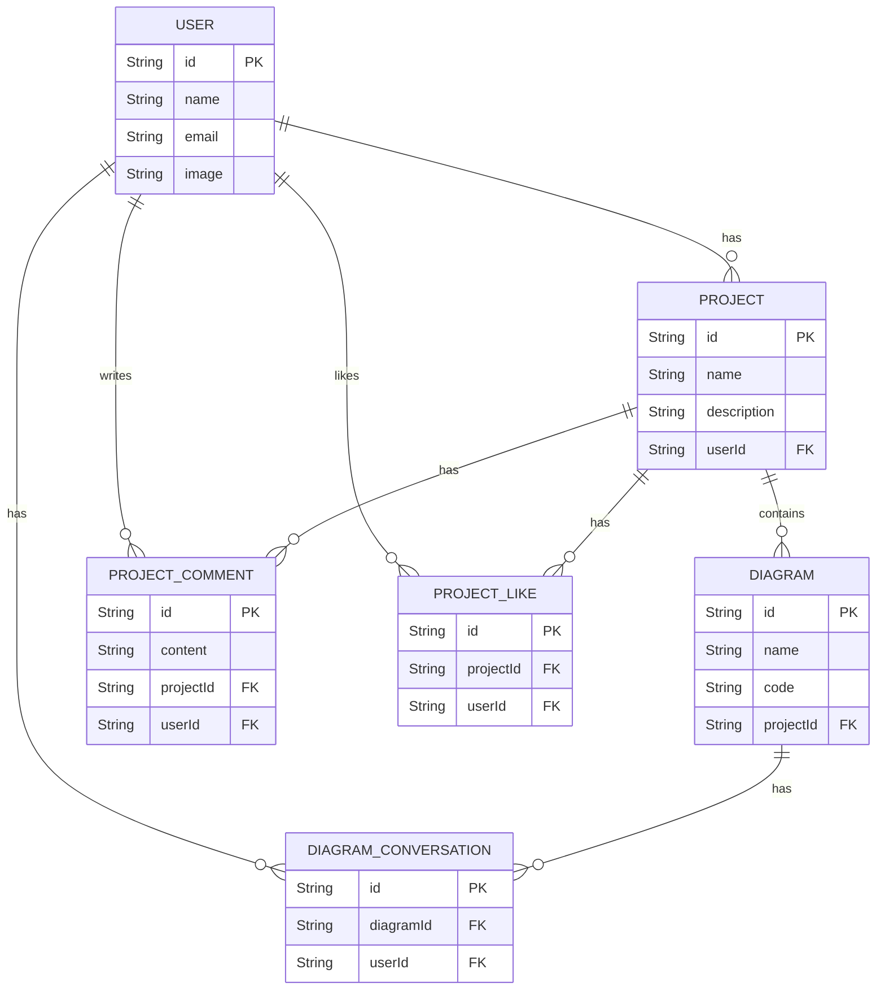

# Project Analysis: plan_ai

This document provides a comprehensive overview of the `plan_ai` project, detailing its database entities and core functionalities. It includes Mermaid diagrams to visualize the data structure and key process flows.

## Entities (Database Models)

The project's data structure is defined using Prisma. The main entities are `User`, `Project`, `Diagram`, and `DiagramConversation`, which are interconnected to build the application's features.

### Entity Relationship Diagram (ERD)



### Entity Descriptions

- **User**: Represents an authenticated user of the application.
- **Account**: Stores user account information from different OAuth providers.
- **Session**: Manages user login sessions.
- **Project**: A container for diagrams created by a user.
- **Diagram**: A specific diagram created with PlantUML code, belonging to a project.
- **ProjectComment**: A comment made by a user on a project.
- **ProjectLike**: Represents a user's "like" on a project.
- **CommentLike**: Represents a user's "like" on a comment.
- **DiagramConversation**: A record of an AI-powered chat session related to a specific diagram.
- **ConversationMessage**: An individual message within a `DiagramConversation`, sent by either the user or the AI.

---

## Core Functions & Methods

The application's backend logic is primarily handled through Next.js API Routes and Server Actions.

### Process Flow: Creating a Diagram

This diagram illustrates the typical user flow for creating a new project and adding a diagram to it.

```mermaid
graph TD
    A[User fills out 'New Project' form] --> B{Server Action: creatProject};
    B --> C[prisma.project.create];
    C --> D{Database: New project saved};
    D --> E[User navigates to project page];
    E --> F[User clicks 'New Diagram'];
    F --> G{API: POST /api/projects/{id}/diagrams};
    G --> H[prisma.diagram.create];
    H --> I{Database: New diagram saved};
    I --> J[User is redirected to the new diagram editor];
```

### Function Descriptions

#### Project Management
- **Create Project**: `(Server Action)` `src/db/action/creatProject.ts`
  - Triggered from a form submission to create a new project associated with the logged-in user.
- **Get Project Details**: `GET /api/projects/{id}`
  - Fetches all data for a single project, including its diagrams.
- **Update Project/Diagram**: `PATCH /api/projects/{id}`
  - Updates the name and code of a diagram within a project.
- **Delete Project**: `DELETE /api/projects/{id}`
  - Deletes a project and cascades to delete all associated diagrams, comments, likes, and stored images from MinIO.

#### Diagram Management
- **Create Diagram**: `POST /api/projects/{projectId}/diagrams`
  - Creates a new diagram record within a specified project.
- **Generate Diagram Image**: `POST /api/diagrams/image`
  - Takes PlantUML code in the request body, sends it to a PlantUML server, and returns the resulting SVG image.

#### Social Features
- **Add Comment**: `POST /api/projects/{projectId}/comments`
  - Adds a new text comment to a project.
- **Toggle Project Like**: `POST /api/projects/{projectId}/like`
  - Adds or removes a `ProjectLike` record, effectively toggling a user's like on a project.

#### AI Conversation
- **Get Conversation History**: `GET /api/ai`
  - Retrieves the message history for a conversation linked to a `diagramId`.
- **Chat with AI**: `POST /api/ai`
  - The core AI function. It takes a user prompt, conversation history, and current diagram code. It then calls an LLM (Gemini or local Ollama), gets a response (often updated diagram code), saves the new messages to the database, and returns the AI's response.
- **Clear Conversation**: `DELETE /api/ai`
  - Deletes all messages associated with a diagram's conversation history.
